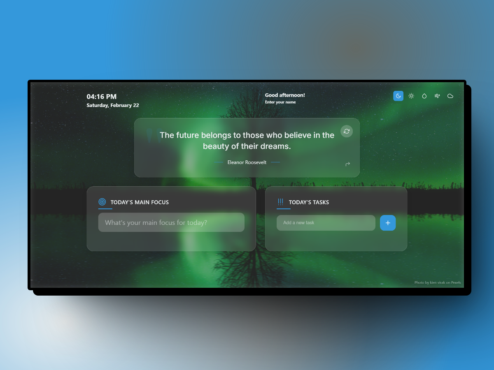

# Chrome New Tab Extension

A beautiful and customizable new tab extension for Chrome that provides a personalized dashboard with quotes, tasks, and stunning backgrounds.



## Features

- 🎨 Beautiful, dynamic backgrounds powered by Pexels API
- 💭 Inspirational quotes that change daily
- ✅ Task management with a simple todo list
- 🎯 Daily focus setting
- ⌚ Clean time and date display
- 🌈 Multiple theme options
- 🖼️ Progressive image loading for smooth transitions
- 🔄 Background preloading for instant switching
- 💾 Local storage for persistence
- 🌐 Offline support with fallback images

## Installation

### From Chrome Web Store
*(Coming Soon)*

### Local Development
1. Clone the repository:
```bash
git clone https://github.com/yourusername/chrome-new-tab.git
cd chrome-new-tab
```

2. Install dependencies:
```bash
npm install
```

3. Create a `.env` file with your Pexels API key:
```
PEXELS_API_KEY=your_api_key_here
```

4. Build the extension:
```bash
npm run build
```

5. Load the extension in Chrome:
   - Open Chrome and navigate to `chrome://extensions/`
   - Enable "Developer mode"
   - Click "Load unpacked"
   - Select the `dist` directory

## Configuration

### Pexels API Key
The extension requires a Pexels API key for background images. You can get one for free at [Pexels API](https://www.pexels.com/api/).

### Theme Customization
The extension comes with multiple built-in themes:
- Default (Dark)
- Nature
- Ocean
- Sunset
- Nordic

## Development

### Project Structure
```
├── src/
│   ├── components/     # React components
│   ├── services/       # Background and API services
│   ├── context/        # React context providers
│   ├── data/          # Static data (quotes, themes)
│   └── utils/         # Utility functions
├── public/            # Static assets
└── docs/             # Documentation
```

### Available Scripts
- `npm start`: Starts development server
- `npm run build`: Builds the extension
- `npm test`: Runs tests
- `npm run lint`: Lints code
- `npm run format`: Formats code

## Contributing

We welcome contributions! Please see our [Contributing Guide](CONTRIBUTING.md) for details.

### Development Process
1. Fork the repository
2. Create your feature branch (`git checkout -b feature/AmazingFeature`)
3. Commit your changes (`git commit -m 'Add some AmazingFeature'`)
4. Push to the branch (`git push origin feature/AmazingFeature`)
5. Open a Pull Request

## Privacy

This extension:
- Does not collect any personal data
- Stores all user data locally
- Makes API calls only to Pexels for background images
- Does not track user behavior

## License

This project is licensed under the MIT License - see the [LICENSE](LICENSE) file for details.

## Acknowledgments

- [Pexels](https://www.pexels.com/) for providing the beautiful background images
- [React](https://reactjs.org/) for the UI framework
- [Framer Motion](https://www.framer.com/motion/) for animations
- All our [contributors](../../contributors) 